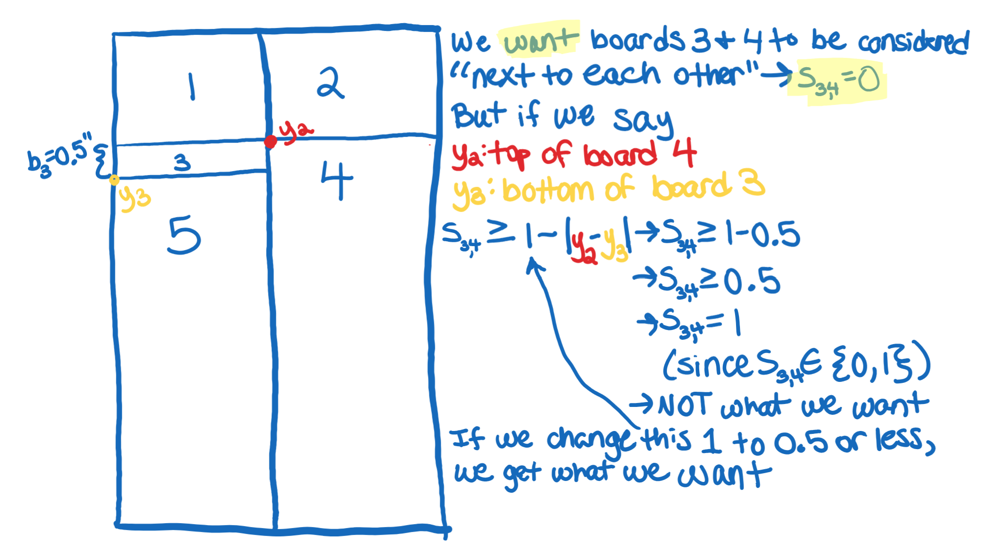
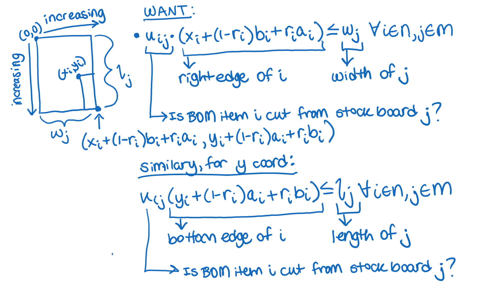

# cut-list
## Motivation:
A few years ago, my family and I built a murphy bed with bookcases in our home. We painstakingly put together our Bill of Materials (BOM) for the project, and found that many of the boards could be cut from large sheets of plywood. 

I searched for an online tool, which, given my BOM, would tell me how many sheets of plywood to buy, and subsequently, how to cut them, with the goal of minimizing cost. I found a tool that was close to what I needed - it told me how to cut stock boards to get my BOM, with the goal of using the fewest boards. However, it assumed I had these stock boards on hand and required that I input their quantities.

I made due with that tool at the time just to get the project done, but I swore I would improve upon it. This is my attempt at doing that.

## TL;DR:
After some research, I was able to formulate the problem as a Mixed Integer Linear Program (MILP). As desired, the model does NOT require the user to input the quantity of stock boards that they own, but generates its own conservative upper bound for the quantity of each stock board they might need to satisfy their BOM. The model also allows the user to limit rotation of the BOM item with respect to the stock board, if grain direction is important to the user.

### Example Output:
CHANGE THIS!
  

See full code in cut_list.ipynb

## Assumptions:
First, let's list our assumptions:
1. The user only intends to cut the stock boards along their two largest dimensions. (eg, they will never cut/plane a 8' x 4' x 0.75" board down to a 8' x 4' x 0.5" board.) The consequence of this assumption is that we only consider cutting BOM items of a given thickness from stock items of the same thickness.
2. The user does not care about which wood species their pieces come from. They simply want to minimize cost. Therefore, the model does not consider - or even know - the grain species of the stock boards or BOM items. If this is a problem, the user can run the model on subsets of stock boards and BOM items according to their species - one run per species.
3. All pieces in the BOM, and all pieces of stock wood, are rectangular prisms.
4. All user-provided dimensions (of BOM items and stock boards available for purchase) are provided in the same units of measure.
5. The solution is feasible.

## Problem Formulation: 

Details

The below was my attempt, before researching, at formulating the problem as an MILP:
Let's see if we can formulate the problem as a Mixed Integer Linear Program (MILP):

### Objective Function & Decision Variables, Attempt 1:
> **Objective is to minimize cost:**\
> $min_{\left(q_j\right)}\left( \sum_{j=1}^&infin; p_j q_j \right)$  

where:  
> $p_j:$ price of stock item $j$    
> $q_j:$ our **decision variables**, representing quantity of stock item $j$ to buy    

### User Inputs:
#### Bill of Materials (BOM):
> $a_i:$ length/max dimension of BOM item $i$  
> $b_i:$ width/mid dimension of BOM item $i$  
> $c_i:$ height/min dimension of BOM item $i$  
> (where $a_i \geq b_i \geq c_i$)  

> [!NOTE]
> For model simplicity, $i$ is one **instance** of a board with given dimensions. If you need 2 of the same board, its dimensions must be given twice.

#### Stock Boards Available for Purchase:
> $l_j:$ length/max dimension of stock item $j$  
> $w_j:$ width/mid dimension of stock item $j$  
> $h_j:$ height/min dimension of stock item $j$  
> (where $l_j \geq w_j \geq h_j$)  
> $p_j:$ price of stock item $j$  

> [!NOTE]
> For model simplicity, $j$ is one **instance** of a stock board with given dimensions. Require the user to give the information only once, but the tool should automatically duplicate it several times*.

*Needs to be defined

### Objective Function & Decision Variables, Attempt 2:
Based on the above, we need to come up with a reasonable upper limit for the quantity of each stock board required to fulfill our BOM. Because we are assuming feasibility, we know that in the worst case, we can only cut one of our BOM boards from each stock board we buy. Of course, we don't know right off the bat which size of stock board would be paired with each BOM item in this worst case. So, a conservative upper limit would be one of *each* type of stock board *per* BOM item.

We will now update our objective function such that the upper bound of our summation is $j=m$ where $m$ is the number of different types of boards times the number of BOM items, $n$. 

We also need to reconsider our decision variables. Keep in mind that because $j$ represents one **instance** of a stock board of given dimensions, $q_j$ can only evaluate to 0 or 1. And we're not planning to directly decide whether or not to buy stock board $j$. Our decision to buy it is a symptom of whether or not we need to cut BOM items from it to fulfill our BOM. So our real decision variables should answer the question "Do we need to cut BOM item $i$ from stock board $j$?":

> **Objective is to minimize cost:**\
> $min_{\left(u_{ij}\right)}\left( \sum_{j=1}^m p_j q_j \right)$  

where:   
> $`u_{ij} = \begin{cases} 1 & \text{if BOM item i is cut from stock board j} \\ 0 & \text{otherwise} \end{cases}`$    
> $`q_{j} = \begin{cases} 1 & \text{if we need to buy stock board j to satisfy our BOM} \\ 0 & \text{otherwise} \end{cases}`$  
> $p_j:$ price of stock item $j$  
> $n:$ total number of BOM items  
> $m:$ upper limit of stock items = number of different types of board $* n$  

### Constraints:
#### 1. All BOM items must be cut exactly once / from exactly one stock board:
> **Constraint 1:**\
> $\sum_{j=1}^m u_{ij} = 1  \forall i$  

#### 2. The thickness (smallest dimension) of each BOM item must match that of the stock item from which it's cut: 
We want to constrain our problem such that:

$`u_{ij} = \begin{cases} 0 & \text{if } c_i \neq h_j \\ \in \{0,1\} & \text{otherwise} \end{cases}`$  

How can this be expressed as an inequality / constraint? Let's consider some examples:

| $c_i$  | $h_j$ | Desired $u_{ij}$ Upper Limit |
| ------------- | ------------- | ------------- |
| 0.75  | 0.75  | 1 (or more)  |
| 0.75  | 0.5  | 0  |
| 0.5  | 0.75  | 0  |

Can we use the ratio of $c_i$ to $h_j$ to get the desired $u_{ij}$?

YES!

We need BOTH of the following:
> **Constraint 2a:**\
> $u_{ij} \leq \frac{c_i}{h_j} \forall i,j$  

> **Constraint 2b:**\
> $u_{ij} \leq \frac{h_j}{c_i} \forall i,j$  

Because if $c_i \neq h_j$, then one of the above ratios will be less than one, and since $u_{ij} \in \{0,1\}$, this will force $u_{ij} = 0$.

#### 3. If any BOM items are planned to be cut from stock board j, we must buy stock board j:
We want to constrain our problem such that, for a given $j$, if any $u_{ij} \forall i$ is set to 1, $q_j$ gets set to 1. 

Based on the definition of $u_{ij}$, we know that $u_{ij}$ will be either 0 or 1 for all values of $i$ and $j$. 

We also know that there will be $n$ total $u_{ij}$ variables for each value of $j$. Using similar logic to constraints 2a and 2b above, we require that:

> **Constraint 3:**\
> $q_j \geq \frac{\sum_{i=1}^n u_{ij}}{n} \forall j$  

If any $u_{ij}$ are equal to 1 for a given stock board $j$, then the numerator will evaluate to some value greater than 0. And, since we defined $q_j$ to be either 0 or 1, this will force $q_j$ to 1. The maximum value of the numerator is $n$, so the right side of this inequality will never evaluate to more than 1.

#### 4. BOM items cannot exceed the boundaries of the stock board from which they're cut:
Using the intentionally complex cut pattern example below, let's consider how to write this constraint in terms of our decision variables.

  

We're going to need additional decision variables, to answer not just "Is BOM item $i$ cut from stock board $j$?" but also, "What is the cut pattern for stock board $j$?". 

To this end, let's create additional decision variables for each BOM item's x and y coordinates with respect to the stock board. Arbitrarily choose the BOM item's upper left corner to be the point represented by $(x_i,y_i)$, such that:  

> $x_i:$ x coordinate of BOM item $i$'s upper left corner with respect to the upper left corner of the stock board from which it's cut  

> $y_i:$ y coordinate of BOM item $i$'s upper left corner with respect to the upper left corner of the stock board from which it's cut

Looking again at the example cut pattern above, there's one more element to this problem that we haven't yet considered. To enable the model to rotate boards, we will also need a decision variable to indicate whether a BOM item is "rotated" with respect to the stock sheet from which it's cut. 

> [!NOTE]
> A BOM item will be considered "rotated" if its longest dimension is **NOT** parallel to the longest dimension of the stock board from which it's cut. 

Call this additional decision variable $r_i$, where:

> $`r_i = \begin{cases} 1 & \text{if BOM item } i \text{ is rotated wrt its stock board} \\ 0 & \text{otherwise} \end{cases}`$  

Using these new decision variables and our existing decision variables $u_{ij}$, we need to devise our constraints that prevent BOM items from exceeding the boundaries of the stock board from which they're cut. Using the above diagram:  

  

##### BOM items' width cannot exceed width of stock board:

  

But wait. This is too restrictive. We don't want the total width of all 5 BOM items to be $\leq$ the stock width. We only want that to be true of each of the following groups of boards because they're next to each other:

  

We need to incorporate a "next to each other" term into the constraint above.

 

Let's enumerate all the ways board 1 can be "next to" board 2:

Wait. Let's simplify this by enumerating the ways 2 boards are NOT "next to each other":

Where:

$"y_1" = y_i \forall i \in {0-n}$  
$"y_2" = y_k \forall k \neq i \in {0-n}$  
$"y_3" = y_i + (1-r_i) \times a_i + r_i \times b_i \forall i \in {0-n}$  
$"y_4" = y_k + (1-r_k) \times a_k + r_k \times b_k \forall k \neq i \in {0-n}$  

___

Let's use $v$ to represent "NOT next to each other", where $v=s + t$, and $s$ and $t$ represent scenarios 1 and 2, respectively, from the photo above:  

> $s_{ik}:$ {0,1} board $i$ is NOT next to board $k$ because board $i$ is ABOVE board $k$  
> $t_{ik}:$ {0,1} board $i$ is NOT next to board $k$ because board $i$ is BELOW board $k$  
> $v_{ik}:$ {0,1} board $i$ is NOT next to board $k$  

> **Constraint 4a:**\
> $v_{ik} = s_{ik} + t_{ik}$   

___

We know we should constrain $s_{ik}$ to be 0 or 1:  
> **Constraint 4b:**\
> $s_{ik} \in {0,1}$  

___

We also want:  
$`s_{ik} = \begin{cases} 1 & \text{if } y_2 \geq y_3 \\ 0 & \text{if } y_2 \lt y_3\end{cases}`$  

Which can be rewritten as:  
$`s_{ik} = \begin{cases} 1 & \text{if } \frac{y_2}{y_3} \geq 1 \\ 0 & \text{if } \frac{y_2}{y_3} \lt 1\end{cases}`$  

Try:  
$s_{ik} \leq \frac{y_2}{y_3}$  

Does this accomplish what we want?  
$`s_{ik} = \begin{cases} 0 & \text{if } y_2 \lt y_3 \text{ as desired}\\ 0,1 & \text{if } y_2 \geq y_3 \text{not restrictive enough, combine with another constraint?}\end{cases}`$  

BUT WAIT: $y_3$ is a non-negative decimal number, and could be equal to zero, which would result in the fraction above having a denominator of zero. Since $y_3$ can never be negative, we can remedy this by simply adding 1 to the numerator and denominator:  

$s_{ik} \leq \frac{y_2 + 1}{y_3 + 1}$  
Replacing $y_2$ and $y_3$ with their definitions above, we get:  

> **Constraint 4c:**\
> $s_{ik} \leq \frac{y_k + 1}{y_i + (1-r_i) \times a_i + r_i \times b_i + 1} \forall i \in {0-n}, k \neq i \in {0-n}$  

___

What additional constraint can we create to force $s_{ik} = 1$ when $\frac{y_2}{y_3} \geq 1$?  

Try:
$s_{ik} \geq y_2 - y_3$    

Does this accomplish what we want?  
$`s_{ik} = \begin{cases} 1 & \text{if } y_2 \gt y_3 \text{ as desired}\\ 0,1 & \text{if } y_2 = y_3 \text{not restrictive enough, combine with another constraint?}\\ 0,1 & \text{if } y_2 \lt y_3 \text{not restrictive enough, but works when combined with constraint 4b}\end{cases}`$  

Let's use it and try to come up with another constraint to handle the case when $y_2 = y_3$
$s_{ik} \geq y_2 - y_3$ 
Replacing $y_2$ and $y_3$ with their definitions above, we get: 

> **Constraint 4d:**\
> $s_{ik} \geq y_k - (y_i + (1-r_i) \times a_i + r_i \times b_i) \forall i \in {0-n}, k \neq i \in {0-n}$  

___

How do we constrain $s_{ik} = 0$ when $y_2 = y_3$?
Try:  
$s_{ik} \geq 1 - |y_2 - y_3|$  

Does this accomplish what we want?  
$`s_{ik} = \begin{cases} 1 & \text{if } y_2 = y_3 \text{ as desired}\\ 1 & \text{if } y_2 - y_3 = 0.5\text{ NOT what we want}\end{cases}`$  

We only want $s_{ik}=1$ when $y_2-y_3$ is 0 (or very close to 0), not just when it's less than 1. Consider this example:  

  

We need to change the "1" on the righthand side of the constraint to be some number smaller than what we expect to be the minimum width of all boards in the BOM. Let's say $\frac{1}{100}$:

$s_{ik} \geq \frac{1}{100} - |y_2 - y_3|$  
Replacing $y_2$ and $y_3$ with their definitions above, we get: 

> **Constraint 4e:**\
> $s_{ik} \geq \frac{1}{100} - |y_k - (y_i + (1-r_i) \times a_i + r_i \times b_i)|  \forall i \in {0-n}, k \neq i \in {0-n} $  

This is the motivation for assumption 6, that the minimum desired width of any BOM item will be greater than $\frac{1}{100}$ units.  

___

We've written all required constraints to cover the first scenario whereby 2 boards are "NOT next to each other". Now we need to write constraints for the second scenario:  

  

Noticing that scenario 2 can be rewritten to look just like scenario 1, we will simply need to replicate the same constraints we created for $s_{ik}$, but replace:  
* $s_{ik}$ with $t_{ik}$  
* $y_2$ with $y_1$  
* $y_3$ with $y_4$  

___

Replicating constraint 4b, we get:  

> **Constraint 4f:**\
> $t_{ik} \in {0,1}$  

___

Replicating constraint 4c, we get:  

$t_{ik} \leq \frac{y_1 + 1}{y_4 + 1}$  

Plugging in our definitions for $y_1$ and $y_4$, we get:  

> **Constraint 4g:**\
> $t_{ik} \leq \frac{y_i + 1}{y_k + (1-r_k) \times a_k + r_k \times b_k + 1} \forall i \in {0-n}, k \neq i \in {0-n}$  

___

Replicating constraint 4d, we get:  

$t_{ik} \geq y_1 - y_4$  

Plugging in our definitions for $y_1$ and $y_4$, we get:  

> **Constraint 4h:**\
> $t_{ik} \geq y_i - (y_k + (1-r_k) \times a_k + r_k \times b_k) \forall i \in {0-n}, k \neq i \in {0-n}$  

___

Replicating constraint 4e, we get:  

$t_{ik} \geq \frac{1}{100} - |y_1 - y_4|$  

Plugging in our definitions for $y_1$ and $y_4$, we get:  

> **Constraint 4i:**\
> $t_{ik} \geq \frac{1}{100} - |y_i - (y_k + (1-r_k) \times a_k + r_k \times b_k)| \forall i \in {0-n}, k \neq i \in {0-n}$  
___

  

___ 

Putting it all together:

  

> **Constraint 4j:**\
> $\sum_{i\neq k}^n u_{ij} \times \left(\left(1-r_i\right) \times b_i + r_i \times a_i\right) \times \left(1-v_{ik} \right) \leq w_j \forall j$  

##### BOM items' height cannot exceed height of stock board:
  

where:  

> $g_{ik}:$ {0,1} boards $i$ and $k$ are NOT in line with each other  

This is nearly identical to the above width constraints, but instead of the "next to each other" term, which is a function of the BOM items' y coordinates, we created a term that signifies "in line with each other", and is a function of the BOM items' x coordinates. Let's try to construct the "NOT in line with each other" term in such a way that we can reuse the above constraints with minimal changes:

  

Where:

$"x_1" = x_i \forall i \in {0-n}$  
$"x_2" = x_k \forall k \neq i \in {0-n}$  
$"x_3" = x_i + (1-r_i) \times b_i + r_i \times a_i \forall i \in {0-n}$  
$"x_4" = x_k + (1-r_k) \times b_k + r_k \times a_k \forall k \neq i \in {0-n}$  

___

We used $g$ to represent "NOT in line with each other" in the constraint above. Let's say that $g=d+f$, where $d$ and $f$ represent scenarios 1 and 2, respectively, from the photo above:  

> $d_{ik}:$ {0,1} board $i$ is NOT in line with board $k$ because board $i$ is to the LEFT of board $k$  
> $f_{ik}:$ {0,1} board $i$ is NOT in line with board $k$ because board $i$ is to the RIGHT of board $k$  

> **Constraint 4k:**\
> $g_{ik} = d_{ik} + f_{ik}$   

___

Constraining $d_{ik}$ to be 0 or 1, as we did with $s_{ik}$ in constraint 4b above:  

> **Constraint 4l:**\
> $s_{ik} \in {0,1}$  

___

Adapting constraint 4c:

$d_{ik} \leq \frac{x_2 + 1}{x_3 + 1}$  
Replacing $x_2$ and $x_3$ with their definitions above, we get:  

> **Constraint 4m:**\
> $d_{ik} \leq \frac{x_k + 1}{x_i + (1-r_i) \times b_i + r_i \times a_i + 1} \forall i,k  \text{ where } i \neq k \in {0-n}$  

___

Adapting constraint 4d:

$d_{ik} \geq x_2 - x_3$  
Replacing $x_2$ and $x_3$ with their definitions above, we get: 

> **Constraint 4n:**\
> $d_{ik} \geq x_k - (x_i + (1-r_i) \times b_i + r_i \times a_i) \forall i,k  \text{ where } i \neq k \in {0-n}$  

___

Adapting constraint 4e:

$d_{ik} \geq \frac{1}{100} - |x_2 - x_3|$  
Replacing $x_2$ and $x_3$ with their definitions above, we get: 

> **Constraint 4o:**\
> $d_{ik} \geq \frac{1}{100} - |x_k - (x_i + (1-r_i) \times b_i + r_i \times a_i)| \forall i,k  \text{ where } i \neq k \in {0-n}$  

___

We've written all required constraints to cover the first scenario whereby 2 boards are "NOT in line each other". Now we need to write constraints for the second scenario, which is defined by variable $f_{ik}$:  

  

Adapting constraint 4f:  

> **Constraint 4p:**\
> $f_{ik} \in {0,1}$  

___

Adapting constraint 4g:  

$f_{ik} \leq \frac{x_1 + 1}{x_4 + 1}$  

Plugging in our definitions for $x_1$ and $x_4$, we get:  

> **Constraint 4q:**\
> $f_{ik} \leq \frac{x_i + 1}{x_k + (1-r_k) \times b_k + r_k \times a_k + 1} \forall i,k  \text{ where } i \neq k \in {0-n}$  

___

Adapting constraint 4h:

$f_{ik} \geq x_1 - x_4$  

Plugging in our definitions for $x_1$ and $x_4$, we get:  

> **Constraint 4r:**\
> $f_{ik} \geq x_i - (x_k + (1-r_k) \times b_k + r_k \times a_k) \forall i,k  \text{ where } i \neq k \in {0-n}$  

___

Adapting constraint 4i:  

$f_{ik} \geq \frac{1}{100} - |x_1 - x_4|$  

Plugging in our definitions for $x_1$ and $x_4$, we get:  

> **Constraint 4s:**\
> $f_{ik} \geq \frac{1}{100} - |x_i - (x_k + (1-r_k) \times b_k + r_k \times a_k)| \forall i,k  \text{ where } i \neq k \in {0-n}$  

___

We've now covered both scenarios:  
  
___

Putting it all together/adapting constraint 4j:  

> **Constraint 4t:**\
> $\sum_{i\neq k}^n u_{ij} \times \left(\left(1 - r_i\right) \times a_i + r_i \times b_i\right) \times \left(1 -g_{ik} \right) \leq l_j \forall j$  

#### 5. BOM items cannot overlap each other:
There are several ways that two boards could overlap each other, including the below examples:
  

Notice that each instance of "overlapping" requires that the two boards be BOTH "next to each other" AND "in line with each other", meaning both their x and y spans overlap. So, to write this constraint, we can take advantage of our earlier definitions of "next to each other" and "in line with each other":

  

We only have an overlapping problem if all 4 of the above terms evaluate to 1 (in other words, if the answer to all 4 questions is "yes"). If any of the 4 evaluate to 0, then the left hand side of the inequality will evaluate to 0, allowing the solution to be considered. Formalizing this constraint:  

> **Constraint 5:**\
> $\sum_{i\neq k}^n u_{ij} \times u_{kj} \times \left(1 - v_{ik}\right) \times \left(1 - g_{ik}\right) \forall j \in m$   

#### 6. Enforce Graph Coordinates:
Constraints 4 & 5 control the *relative* positioning of BOM items, and ensure that their combined dimensions do not exceed the overall dimensions of the stock boards from which they're cut. However, they do not enforce our desired coordinate plane for graphically depicting our cut list. We want:

  

##### 6a. Each BOM item's right edge cannot exceed the width of the stock board from which it's cut:  
> **Constraint 6a:**\
> $u_{ij} \times \left(x_i + (1-r_i)\times b_i + r_i\times a_i \right) \leq w_j \forall i,j$

##### 6b. Each BOM item's bottom edge cannot exceed the length of the stock board from which it's cut:  
> **Constraint 6b:**\
> $u_{ij} \times \left(y_i + (1-r_i)\times a_i + r_i\times b_i \right) \leq l_j \forall i,j$

#### 7. Integer constraints:
> **Constraint 7:**\
> $u_{ij}, q_j, r_i \in\{0,1\} \forall i,j$  

#### 8. Non-negativity constraints:
> **Constraint 8:**\
> $x_i, y_i \geq 0 \forall i$  

### The Final Problem, Pre-Research:  
We set out to create a Mixed Integer Linear Program, but ended up having to incorporate quadratic constraints (see constraint 4), so we ended up with a Mixed Integer Quadratically Constrained Problem, as follows:

**Objective is to minimize cost:**  
> $min_{\left(u_{ij}, x_i, y_i, r_i\right)}\left( \sum_{j=1}^m p_j q_j \right)$  

**Variable Definitions:**  
User-Provided or Derived from User-Provided:  
> $a_i:$ length/max dimension of BOM item $i$  
> $b_i:$ width/mid dimension of BOM item $i$  
> $c_i:$ height/min dimension of BOM item $i$  
> $l_j:$ length/max dimension of stock item $j$  
> $w_j:$ width/mid dimension of stock item $j$  
> $h_j:$ height/min dimension of stock item $j$  
> $p_j:$ price of stock item $j$  
> $n:$ total number of BOM items  
> $m:$ upper limit of stock items = number of different types of board $* n$  

Decision Variables:  
> $`u_{ij} = \begin{cases} 1 & \text{if BOM item i is cut from stock board j} \\ 0 & \text{otherwise} \end{cases}`$  
> $x_i:$ x coordinate of BOM item $i$'s upper left corner with respect to the upper left corner of the stock board from which it's cut  
> $y_i:$ y coordinate of BOM item $i$'s upper left corner with respect to the upper left corner of the stock board from which it's cut  
> $`r_i = \begin{cases} 1 & \text{if BOM item } i \text{ is rotated wrt its stock board} \\ 0 & \text{otherwise} \end{cases}`$  

Intermediate Variables:  
> $`q_{j} = \begin{cases} 1 & \text{if we need to buy stock board j to satisfy our BOM} \\ 0 & \text{otherwise} \end{cases}`$  
> $s_{ik}:$ {0,1} board $i$ is NOT next to board $k$ because board $i$ is ABOVE board $k$  
> $t_{ik}:$ {0,1} board $i$ is NOT next to board $k$ because board $i$ is BELOW board $k$  
> $v_{ik}:$ {0,1} board $i$ is NOT next to board $k$  
> $d_{ik}:$ {0,1} board $i$ is NOT in line with board $k$ because board $i$ is to the LEFT of board $k$  
> $f_{ik}:$ {0,1} board $i$ is NOT in line with board $k$ because board $i$ is to the RIGHT of board $k$  
> $g_{ik}:$ {0,1} boards $i$ and $k$ are NOT in line with each other  

**Subject to constraints:**  
>**1. All BOM items must be cut exactly once / from exactly one stock board:**  
> $\sum_{j=1}^m u_{ij} = 1  \forall i$  

>**2. The thickness (smallest dimension) of each BOM item must match that of the stock item from which it's cut:**  
>   - **a.** $u_{ij} \leq \frac{c_i}{h_j} \forall i,j$  
>   - **b.** $u_{ij} \leq \frac{h_j}{c_i} \forall i,j$  

>**3.  If any BOM items are planned to be cut from stock board j, we must buy stock board j:**  
>$q_j \geq \frac{\sum_{i=1}^n u_{ij}}{n} \forall j$  

>**4. BOM items cannot exceed the boundaries of the stock board from which they're cut:**
>   - **a.** $v_{ik} = s_{ik} + t_{ik}$  
>   - **b.** $s_{ik} \in {0,1}$  
>   - **c.** $s_{ik} \leq \frac{y_k + 1}{y_i + (1-r_i) \times a_i + r_i \times b_i + 1} \forall i \in {0-n}, k \neq i \in {0-n}$  
>   - **d.** $s_{ik} \geq y_k - (y_i + (1-r_i) \times a_i + r_i \times b_i) \forall i \in {0-n}, k \neq i \in {0-n}$  
>   - **e.** $s_{ik} \geq \frac{1}{100} - |y_k - (y_i + (1-r_i) \times a_i + r_i \times b_i)|  \forall i \in {0-n}, k \neq i \in {0-n} $  
>   - **f.** $t_{ik} \in {0,1}$  
>   - **g.** $t_{ik} \leq \frac{y_i + 1}{y_k + (1-r_k) \times a_k + r_k \times b_k + 1} \forall i \in {0-n}, k \neq i \in {0-n}$  
>   - **h.** $t_{ik} \geq y_i - (y_k + (1-r_k) \times a_k + r_k \times b_k) \forall i \in {0-n}, k \neq i \in {0-n}$  
>   - **i.** $t_{ik} \geq \frac{1}{100} - |y_i - (y_k + (1-r_k) \times a_k + r_k \times b_k)| \forall i \in {0-n}, k \neq i \in {0-n}$  
>   - **j.** $\sum_{i\neq k}^n u_{ij} \times \left(\left(1-r_i\right) \times b_i + r_i \times a_i\right) \times \left(1-v_{ik} \right) \leq w_j \forall j$  
>   - **k.** $g_{ik} = d_{ik} + f_{ik}$  
>   - **l.** $s_{ik} \in {0,1}$  
>   - **m.** $d_{ik} \leq \frac{x_k + 1}{x_i + (1-r_i) \times b_i + r_i \times a_i + 1} \forall i,k  \text{ where } i \neq k \in {0-n}$  
>   - **n.** $d_{ik} \geq x_k - (x_i + (1-r_i) \times b_i + r_i \times a_i) \forall i,k  \text{ where } i \neq k \in {0-n}$  
>   - **o.** $d_{ik} \geq \frac{1}{100} - |x_k - (x_i + (1-r_i) \times b_i + r_i \times a_i)| \forall i,k  \text{ where } i \neq k \in {0-n}$  
>   - **p.** $f_{ik} \in {0,1}$  
>   - **q.** $f_{ik} \leq \frac{x_i + 1}{x_k + (1-r_k) \times b_k + r_k \times a_k + 1} \forall i,k  \text{ where } i \neq k \in {0-n}$  
>   - **r.** $f_{ik} \geq x_i - (x_k + (1-r_k) \times b_k + r_k \times a_k) \forall i,k  \text{ where } i \neq k \in {0-n}$  
>   - **s.** $f_{ik} \geq \frac{1}{100} - |x_i - (x_k + (1-r_k) \times b_k + r_k \times a_k)| \forall i,k  \text{ where } i \neq k \in {0-n}$  
>   - **t.** $\sum_{i\neq k}^n u_{ij} \times \left(\left(1 - r_i\right) \times a_i + r_i \times b_i\right) \times \left(1 -g_{ik} \right) \leq l_j \forall j$  

> **5. BOM items cannot overlap each other:** \
> $\sum_{i\neq k}^n u_{ij} \times u_{kj} \times \left(1 - v_{ik}\right) \times \left(1 - g_{ik}\right) = 0 \forall j \in m$  

> **6. Enforce Graph Coordinates:**  
>   - **a.** $u_{ij} \times \left(x_i + (1-r_i)\times b_i + r_i\times a_i \right) \leq w_j \forall i,j$  
>   - **b.** $u_{ij} \times \left(y_i + (1-r_i)\times a_i + r_i\times b_i \right) \leq l_j \forall i,j$  

> **7. Integer Constraints:** \
> $u_{ij}, q_j, r_i \in\{0,1\} \forall i,j$  

> **8. Non-negativity Constraints:** \
> $x_i, y_i \geq 0 \forall i$  

### Results of the MICQP:
> 1. Simple vertical stacking example - Finds Optimal Solution:
 

> 2. Simple horizontal stacking example - Finds Optimal Solution:
 

> 3. "Quadrant" style example - Finds Optimal Solution:
 

> 4. More complex "quadrant" + long skinny board example - Fails to find optimal solution. Solution found by model requires more expensive 15' x 15' board, whereas hand-constructed example uses less expensive 10' x 10' board:
 
 

I was able to isolate the problem to constraints 4j and 4t, which are too restrictive to allow board 2 to be "next to" boards 0,1, and 3 while also accounting for the fact that boards 0 and 1 are NOT next to board 3. 

### Objective Function & Decision Variables:
> **Objective is to minimize total board cost**:  
> $\displaystyle \min_{z,u,x,y,r,left,right,above,below}\\sum_{k\in\mathcal{K}}\sum_{j\in\mathcal{J}} c_j,z_{kj}$

where:

> $`z_{kj} = \begin{cases} 1 & \text{if slot } k \text{ uses stock type } j \\ 0 & \text{otherwise} \end{cases}`$

> $`u_{ik} = \begin{cases} 1 & \text{if item } i \text{ is cut from board slot } k \\ 0 & \text{otherwise} \end{cases}`$

> $r_i:$ rotation flag for item $i$ (1 = rotated 90°, 0 = not rotated)  

> $x_{ik},y_{ik}:$ lower-left coordinates of item $i$ on board $k$  

> $left_{ii'k},right_{ii'k},above_{ii'k},below_{ii'k}:$ binaries enforcing non-overlap between items $i,i'$ on board $k$  

### Parameters

| Symbol  | Meaning |
| ------------- | ------------- |
| $\mathcal{I}$  | set of items (BOM parts)  |
| $\mathcal{J}$  | set of stock board types  |
| $\mathcal{K}$  | set of potential board slots (upper bound on purchased boards)  |
| $a_i,b_i,\tau_i$  | item $i$ length, width, thickness  |
| $R_i\in{0,1}$  | rotation allowed flag  |
| $L_j,W_j,\Theta_j,c_j$  | stock type $j$ length, width, thickness, cost  |
| $s$  | in-plane kerf / gap allowance  |
| $M_x,M_y$  | big-M constants (e.g., max board width / length)  |

Define the thickness-compatible stock types:

> $\mathcal{J}_i={j\in\mathcal{J}:\Theta_j=\tau_i}$

### Derived Quantities

Effective (possibly rotated) in-plane dimensions of each item $i$:  

> $w_i = (1-r_i) \times b_i + r_i \times a_i + s$  
> $h_i = (1-r_i) \times a_i + r_i \times b_i + s$  

Board dimensions chosen for slot $k$:  

> $W_k = \sum_{j\in\mathcal{J}} W_j \times z_{kj}$    

> $L_k = \sum_{j\in\mathcal{J}} L_j \times z_{kj}$  

### Constraints
1. At most one stock type per slot:  

> $\displaystyle \sum_{j\in\mathcal{J}} z_{kj} \le 1 \qquad \forall k\in\mathcal{K}$  

2. Each item assigned to exactly one slot:  

> $\displaystyle \sum_{k\in\mathcal{K}} u_{ik} = 1 \qquad \forall i\in\mathcal{I}$  

3️. Thickness compatibility and slot activeness:  

> $\displaystyle u_{ik} \le \sum_{j\in\mathcal{J}i} z{kj} \qquad \forall i\in\mathcal{I},;k\in\mathcal{K}$  

4️. Items must fit within their assigned boards:  

$\begin{aligned}
x_{ik} &\le W_k - w_i + M_x(1-u_{ik}) \quad &&\forall i,k \[4pt]
y_{ik} &\le L_k - h_i + M_y(1-u_{ik}) \quad &&\forall i,k \[4pt]
x_{ik} &\ge 0,\quad y_{ik}\ge 0 \quad &&\forall i,k
\end{aligned}$  

5️. Non-overlap (4-way disjunction):  
If items $i,i'$ share a board $k$, at least one positional relation must hold:

> $\text{left}{ii'k}+\text{right}{ii'k}+\text{above}{ii'k}+\text{below}{ii'k}\ge u_{ik}+u_{i'k}-1 \qquad \forall i<i',k$  

Big-M implications for each spatial relation:

$\begin{aligned}
\text{Left:};&x_{ik}+w_i\le x_{i'k}+M_x(1-\text{left}{ii'k}) \[2pt]
\text{Right:};&x{i'k}+w_{i'}\le x_{ik}+M_x(1-\text{right}{ii'k}) \[2pt]
\text{Above:};&y{ik}+h_i\le y_{i'k}+M_y(1-\text{above}{ii'k}) \[2pt]
\text{Below:};&y{i'k}+h_{i'}\le y_{ik}+M_y(1-\text{below}_{ii'k})
\end{aligned}$  

6️. Rotation policy:  

$0\le r_i\le R_i,\quad r_i\in{0,1}\qquad\forall i\in\mathcal{I}$  

### Outputs

Purchase list: number of boards per stock type  
> $n_j=\sum_k z_{kj}$  

Cut list: item $i$ → slot $k$, board type $j$, position $(x_{ik},y_{ik})$, orientation $r_i$, and effective size $(w_i,h_i,\tau_i)$  

## Future Work:
* Enable user to specify multiple desired wood species for one project without having to run the model multiple times.
* Pull candidate stock items from common hardware stores' APIs instead of requiring user to input their information.