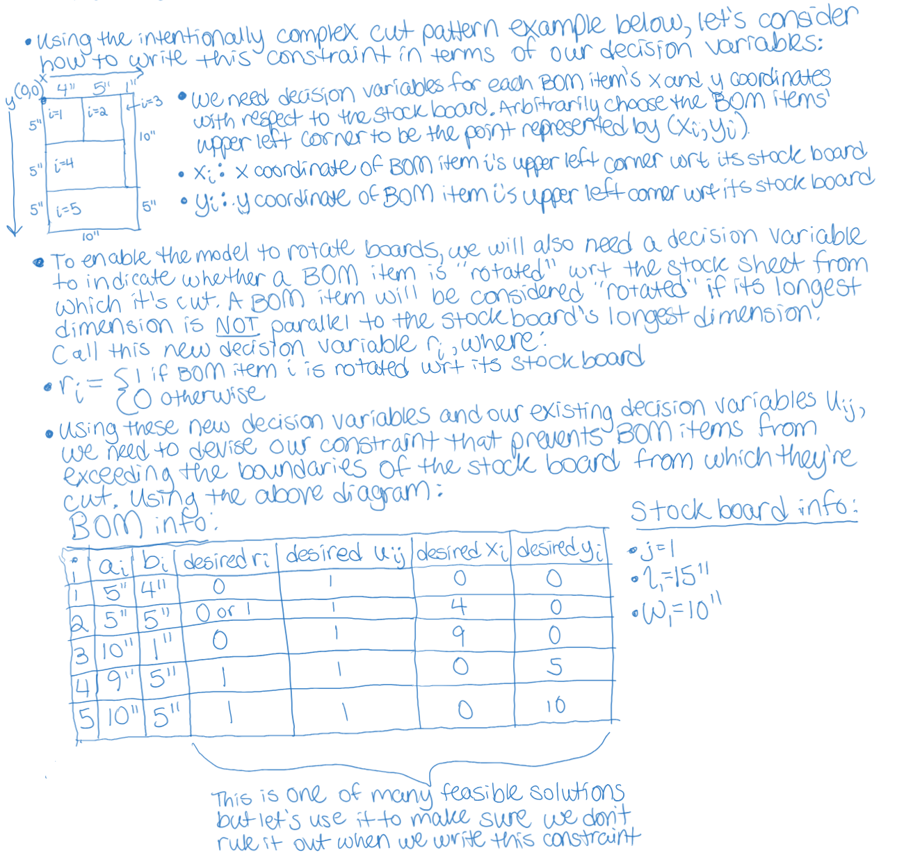
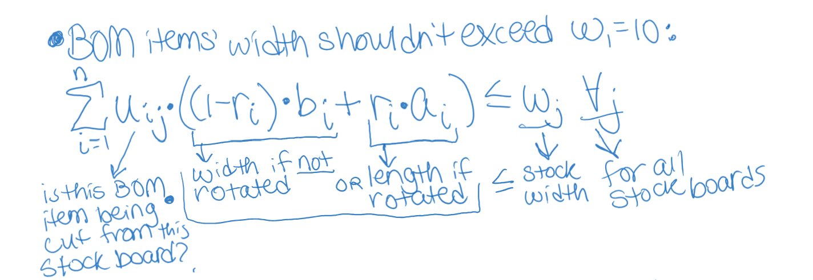
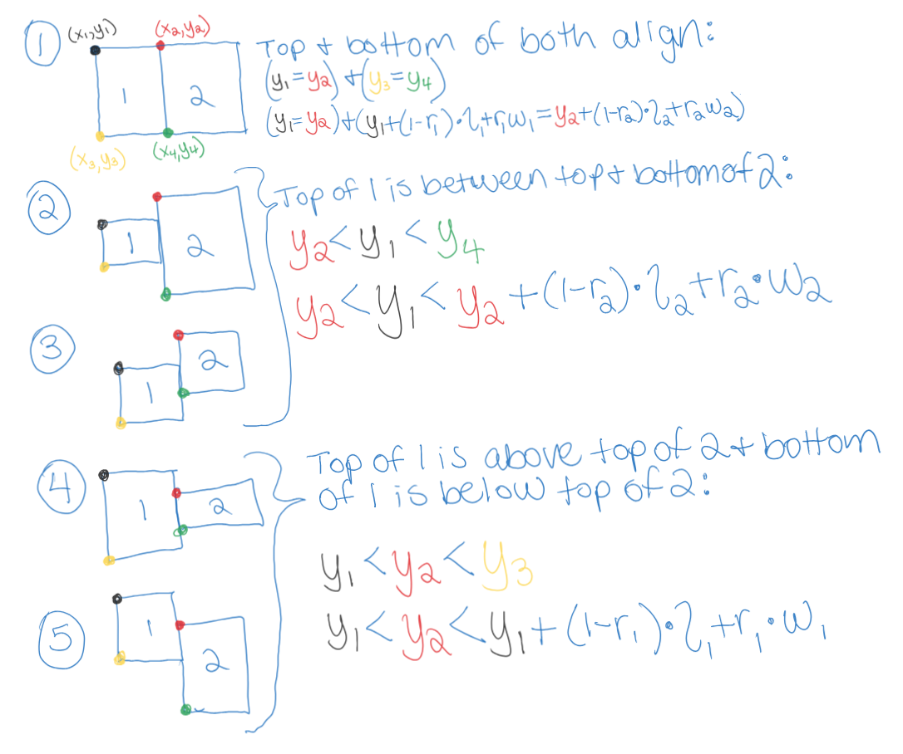

# cut-list
## Motivation:
A few years ago, my family and I built a murphy bed with bookcases in our home. We painstakingly put together our Bill of Materials (BOM) for the project, and found that many of the boards could be cut from large sheets of plywood. 

I searched for an online tool, which, given my BOM, would tell me how many sheets of plywood to buy, and subsequently, how to cut them, with the goal of minimizing cost. I found a tool that was close to what I needed - it told me how to cut stock boards to get my BOM, with the goal of using the fewest boards. However, it assumed I had these stock boards on hand and required that I input their quantities.

I made due with that tool at the time just to get the project done, but I swore I would improve upon it. This is my attempt at doing that.

## Assumptions:
First, let's list our assumptions:
* The user only intends to cut the stock boards along their two largest dimensions. (eg, they will never cut/plane a 8' x 4' x 0.75" board down to a 8' x 4' x 0.5" board.) The consequence of this assumption is that we only consider cutting BOM items of a given thickness from stock items of the same thickness.
* Grain direction doesn't matter. In other words, the user does not mind if some of the grain "points" vertically on one board and points horizontally on another. The consequence of this assumption is that we don't have to know - or consider - grain direction when "rotating" BOM items to fit them together on a stock board.
* The user does not care about which wood species their pieces come from.
* All pieces in the BOM, and all pieces of stock wood, are rectangular prisms.
* The solution is feasible.

## Problem Formulation:
Next, let's see if we can formulate the problem as a Mixed Integer Linear Program (MILP):

### Objective Function & Decision Variables, Attempt 1:
**Objective is to minimize cost:**\
$min\left( \sum_{j=0}^&infin; p_j q_j \right)$  
where:  
$p_j:$ price of stock item $j$    
$q_j:$ our **decision variables**, representing quantity of stock item $j$ to buy    

### User Inputs:
#### Bill of Materials (BOM):
$a_i:$ length/max dimension of BOM item $i$  
$b_i:$ width/mid dimension of BOM item $i$  
$c_i:$ height/min dimension of BOM item $i$  

(where $a_i \geq b_i \geq c_i$)  

For model simplicity, $i$ is one **instance** of a board with given dimensions. If you need 2 of the same board, its dimensions must be given twice.

#### Stock Boards Available for Purchase:
$l_j:$ length/max dimension of stock item $j$  
$w_j:$ width/mid dimension of stock item $j$  
$h_j:$ height/min dimension of stock item $j$  

(where $l_j \geq w_j \geq h_j$)  

$p_j:$ price of stock item $j$  

For model simplicity, $j$ is one **instance** of a stock board with given dimensions. Require the user to give the information only once, but the tool should automatically duplicate it several times*.

*Needs to be defined

### Objective Function & Decision Variables, Attempt 2:
Based on the above, we need to come up with a reasonable upper limit for the quantity of each stock board required to fulfill our BOM. Because we are assuming feasibility, we know that in the worst case scenario, we can only cut one of our BOM boards from each stock board we buy. Of course, we don't know right off the bat which size of stock board would be paired with each BOM item in this worst case. So, a conservative upper limit would be one of *each* type of stock board *per* BOM item.

Objective is still to minimize cost, but we need to expand on $q_i$: 
$min\left( \sum_{j=0}^&infin; p_j \~~q_j\~~ \right)$    
$min\left( \sum_{j=0}^m p_j \sum_{i=0}^n u_{ij} \right)$  

### Constraints:
#### 1. All BOM items must be cut exactly once / from exactly one stock board:

#### 2. The thickness (smallest dimension) of each BOM item must match that of the stock item from which it's cut: 

#### 3. BOM items cannot exceed the boundaries of the stock board from which they're cut:

Let's enumerate all the ways board 1 can be "next to" board 2:

Wait. Let's simplify this by enumerating the ways 2 boards are NOT "next to each other":

#### 4. BOM items cannot overlap each other:

#### 5. All u_ij must be a non-negative integer:

## Future Work:
* Create GUI for tool.
* Enable user to specify grain direction preferences.
* Enable user to specify multiple desired wood species for one project without having to run the model multiple times.
* Pull candidate stock items from common hardware stores' APIs instead of requiring user to input their information.