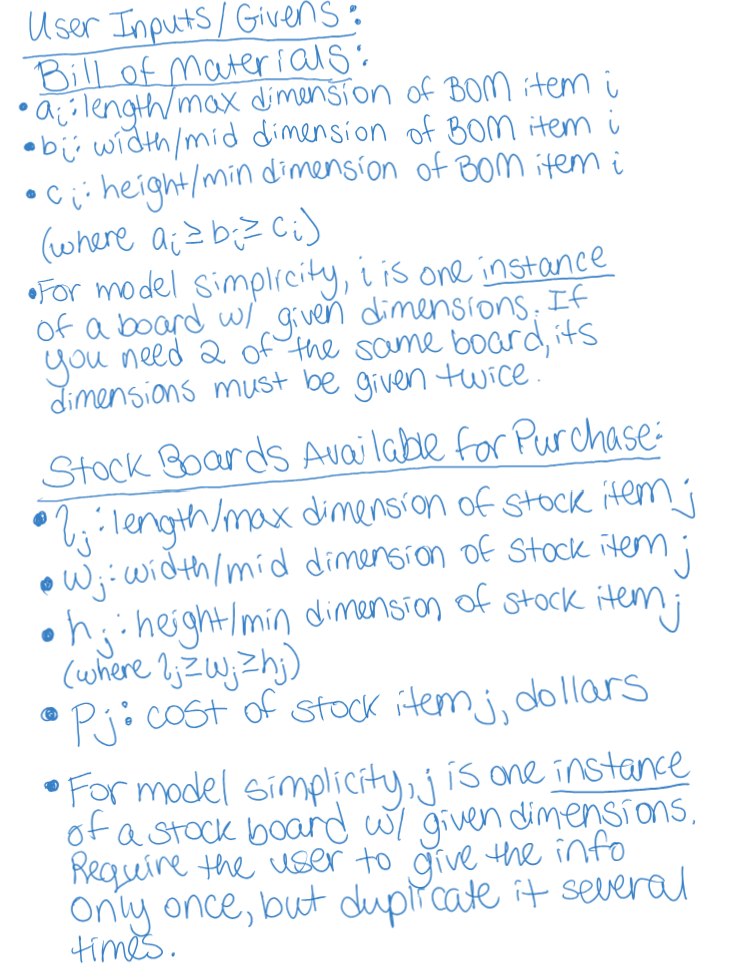

# cut-list
## Motivation:
A few years ago, my family and I built a murphy bed with bookcases in our home. We painstakingly put together our Bill of Materials (BOM) for the project, and found that many of the boards could be cut from large sheets of plywood. 

I searched for an online tool, which, given my BOM, would tell me how many sheets of plywood to buy, and subsequently, how to cut them, with the goal of minimizing cost. I found a tool that was close to what I needed - it told you how to cut stock boards to get your BOM, with the goal of using the fewest boards. However, it assumed you had these stock boards on hand and required that you input their quantities and dimensions.

I made due with that tool at the time just to get the project done, but I swore I would improve upon it. This is my attempt at doing just that.

## Assumptions:
First, let's list our assumptions:
* The user only intends to cut the stock boards along their two largest dimensions. (eg, they will never cut/plane a 8' x 4' x 0.75" board down to a 8' x 4' x 0.5" board.) The consequence of this assumption is that we only consider cutting BOM items of a given thickness from stock items of the same thickness.
* Grain direction doesn't matter. In other words, the user does not mind if some of the grain "points" vertically on one board and points horizontally on another. The consequence of this assumption is that we don't have to know - or consider - grain direction when "rotating" BOM items to fit them together on a stock board.
* The user does not care about which wood species their pieces come from.
* All pieces in the BOM, and all pieces of stock wood, are rectangular prisms.
* The solution is feasible.

## Problem Formulation:
Next, let's see if we can formulate the problem as a Mixed Integer Linear Program (MILP):

### Objective Function, Attempt 1:

### User Inputs:

## Future Work:
* Create GUI for tool.
* Enable user to specify grain direction preferences.
* Enable user to specify multiple desired wood species for one project without having to run the model multiple times.
* Pull candidate stock items from common hardware stores' APIs instead of requiring user to input their information.