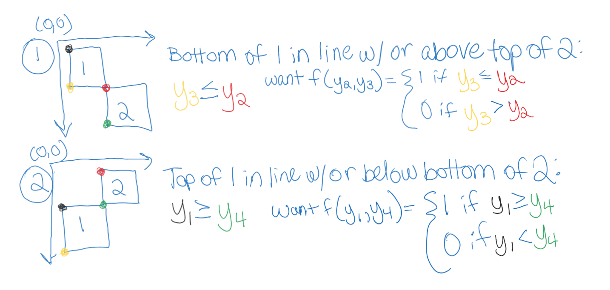

# cut-list
## Motivation:
A few years ago, my family and I built a murphy bed with bookcases in our home. We painstakingly put together our Bill of Materials (BOM) for the project, and found that many of the boards could be cut from large sheets of plywood. 

I searched for an online tool, which, given my BOM, would tell me how many sheets of plywood to buy, and subsequently, how to cut them, with the goal of minimizing cost. I found a tool that was close to what I needed - it told me how to cut stock boards to get my BOM, with the goal of using the fewest boards. However, it assumed I had these stock boards on hand and required that I input their quantities.

I made due with that tool at the time just to get the project done, but I swore I would improve upon it. This is my attempt at doing that.

## Assumptions:
First, let's list our assumptions:
1. The user only intends to cut the stock boards along their two largest dimensions. (eg, they will never cut/plane a 8' x 4' x 0.75" board down to a 8' x 4' x 0.5" board.) The consequence of this assumption is that we only consider cutting BOM items of a given thickness from stock items of the same thickness.
2. Grain direction doesn't matter. In other words, the user does not mind if some of the grain "points" vertically on one board and "points" horizontally on another. The consequence of this assumption is that we don't have to consider - or even know - grain direction when "rotating" BOM items to fit them together on a stock board.
3. The user does not care about which wood species their pieces come from. They simply want to minimize cost.
4. All pieces in the BOM, and all pieces of stock wood, are rectangular prisms.
5. All user-provided dimensions (of BOM items and stock boards available for purchase) are provided in the same units of measure.
6. The minimum desired width for any BOM item will be greater than $\frac{1}{100}$ units (see constraint 4d below).
7. The solution is feasible.

## Problem Formulation:
Next, let's see if we can formulate the problem as a Mixed Integer Linear Program (MILP):

### Objective Function & Decision Variables, Attempt 1:
> **Objective is to minimize cost:**\
> $min_{\left(q_j\right)}\left( \sum_{j=1}^&infin; p_j q_j \right)$  

where:  
> $p_j:$ price of stock item $j$    
> $q_j:$ our **decision variables**, representing quantity of stock item $j$ to buy    

### User Inputs:
#### Bill of Materials (BOM):
> $a_i:$ length/max dimension of BOM item $i$  
> $b_i:$ width/mid dimension of BOM item $i$  
> $c_i:$ height/min dimension of BOM item $i$  
> (where $a_i \geq b_i \geq c_i$)  

> [!NOTE]
> For model simplicity, $i$ is one **instance** of a board with given dimensions. If you need 2 of the same board, its dimensions must be given twice.

#### Stock Boards Available for Purchase:
> $l_j:$ length/max dimension of stock item $j$  
> $w_j:$ width/mid dimension of stock item $j$  
> $h_j:$ height/min dimension of stock item $j$  
> (where $l_j \geq w_j \geq h_j$)  
> $p_j:$ price of stock item $j$  

> [!NOTE]
> For model simplicity, $j$ is one **instance** of a stock board with given dimensions. Require the user to give the information only once, but the tool should automatically duplicate it several times*.

*Needs to be defined

### Objective Function & Decision Variables, Attempt 2:
Based on the above, we need to come up with a reasonable upper limit for the quantity of each stock board required to fulfill our BOM. Because we are assuming feasibility, we know that in the worst case, we can only cut one of our BOM boards from each stock board we buy. Of course, we don't know right off the bat which size of stock board would be paired with each BOM item in this worst case. So, a conservative upper limit would be one of *each* type of stock board *per* BOM item.

We now update our objective function such that the upper bound of our summation is $j=m$ where $m$ is the number of different types of boards times the number of BOM items, $n$. Our objective is still to minimize cost, but $q_j$ is no longer a decision variable, but a function of our new decision variable, $u_{ij}$. Keep in mind that because $j$ represents one **instance** of a stock board of given dimensions, $q_j$ can only evaluate to 0 or 1. 

> **Objective is to minimize cost:**\
> $min_{\left(u_{ij}\right)}\left( \sum_{j=1}^m p_j q_j \right)$  

where:   
> $`u_{ij} = \begin{cases} 1 & \text{if BOM item i is cut from stock board j} \\ 0 & \text{otherwise} \end{cases}`$    
> $`q_{j} = \begin{cases} 1 & \text{if we need to buy stock board j to satisfy our BOM} \\ 0 & \text{otherwise} \end{cases}`$  
> $p_j:$ price of stock item $j$  
> $n:$ total number of BOM items  
> $m:$ upper limit of stock items = number of different types of board $* n$  

### Constraints:
#### 1. All BOM items must be cut exactly once / from exactly one stock board:
> **Constraint 1:**\
> $\sum_{j=1}^m u_{ij} = 1  \forall i$  

#### 2. The thickness (smallest dimension) of each BOM item must match that of the stock item from which it's cut: 
We want to constrain our problem such that:

$`u_{ij} = \begin{cases} 0 & \text{if } c_i \neq h_j \\ \in \{0,1\} & \text{otherwise} \end{cases}`$  

How can this be expressed as an inequality / constraint? Let's consider some examples:

| $c_i$  | $h_j$ | Desired $u_{ij}$ Upper Limit |
| ------------- | ------------- | ------------- |
| 0.75  | 0.75  | 1 (or more)  |
| 0.75  | 0.5  | 0  |
| 0.5  | 0.75  | 0  |

Can we use the ratio of $c_i$ to $h_j$ to get the desired $u_{ij}$?

YES!

We need BOTH of the following:
> **Constraint 2a:**\
> $u_{ij} \leq \frac{c_i}{h_j} \forall i,j$  

> **Constraint 2b:**\
> $u_{ij} \leq \frac{h_j}{c_i} \forall i,j$  

Because if $c_i \neq h_j$, then one of the above ratios will be less than one, and since $u_{ij} \in \{0,1\}$, this will force $u_{ij} = 0$.

#### 3. If any BOM items are planned to be cut from stock board j, we must buy stock board j:
We want to constraint our problem such that, for a given $j$, if any $u_{ij} \forall i$ is set to 1, $q_j$ gets set to 1. 

Based on the definition of $u_{ij}$, we know that $u_{ij}$ will be either 0 or 1 for all values of $i$ and $j$. 

We also know that there will be $n$ total $u_{ij}$ variables for each value of $j$. Using similar logic to constraints 2a and 2b above, we require that:

> **Constraint 3:**\
> $q_j \geq \frac{\sum_{i=1}^n u_{ij}}{n} \forall j$  

If any $u_{ij}$ are equal to 1 for a given stock board $j$, then the numerator will evaluate to some value greater than 0. And, since we defined $q_j$ to be either 0 or 1, this will force $q_j$ to 1. The maximum value of the numerator is $n$, so the right side of this inequality will never evaluate to more than 1.

#### 4. BOM items cannot exceed the boundaries of the stock board from which they're cut:
Using the intentionally complex cut pattern example below, let's consider how to write this constraint in terms of our decision variables.

  

We're going to need additional decision variables, to answer not just "Is BOM item $i$ cut from stock board $j$?" but also, "What is the cut pattern for stock board $j$?". 

To this end, let's create additional decision variables for each BOM item's x and y coordinates with respect to the stock board. Arbitrarily choose the BOM item's upper left corner to be the point represented by $(x_i,y_i)$, such that:  

> $x_i:$ x coordinate of BOM item $i$'s upper left corner with respect to the upper left corner of the stock board from which it's cut  

> $y_i:$ y coordinate of BOM item $i$'s upper left corner with respect to the upper left corner of the stock board from which it's cut

Looking again at the example cut pattern above, there's one more element to this problem that we haven't yet considered. To enable the model to rotate boards, we will also need a decision variable to indicate whether a BOM item is "rotated" with respect to the stock sheet from which it's cut. 

> [!NOTE]
> A BOM item will be considered "rotated" if its longest dimension is **NOT** parallel to the longest dimension of the stock board from which it's cut. 

Call this additional decision variable $r_i$, where:

> $`r_i = \begin{cases} 1 & \text{if BOM item } i \text{ is rotated wrt its stock board} \\ 0 & \text{otherwise} \end{cases}`$ 

Using these new decision variables and our existing decision variables $u_{ij}$, we need to devise our constraints that prevent BOM items from exceeding the boundaries of the stock board from which they're cut. Using the above diagram:  

  

##### BOM items' width cannot exceed width of stock board:

  

But wait. This is too restrictive. We don't want the total width of all 5 BOM items to be $\leq$ the stock width. We only want that to be true of each of the following groups of boards because they're next to each other:

  

We need to incorporate a "next to each other" term into the constraint above.

 

Let's enumerate all the ways board 1 can be "next to" board 2:

Wait. Let's simplify this by enumerating the ways 2 boards are NOT "next to each other":

Where:

$"y_1" = y_i \forall i \in {0-n}$  
$"y_2" = y_k \forall k \neq i \in {0-n}$  
$"y_3" = y_i + (1-r_i) \times l_i + r_i \times w_i \forall i \in {0-n}$  
$"y_4" = y_k + (1-r_k) \times l_k + r_k \times w_k \forall k \neq i \in {0-n}$  

___

Let's use $v$ to represent "NOT next to each other", where $v=s + t$, and $s$ and $t$ represent scenarios 1 and 2, respectively, from the photo above:  

> $s_{ik}:$ {0,1} board $i$ is NOT next to board $k$ because board $i$ is ABOVE board $k$  
> $t_{ik}:$ {0,1} board $i$ is NOT next to board $k$ because board $i$ is BELOW board $k$  
> $v_{ik}:$ {0,1} board $i$ is NOT next to board $k$  

> **Constraint 4a:**\
> $v_{ik} = s_{ik} + t_{ik}$   

___

We know we should constrain $s_{ik}$ to be 0 or 1:  
> **Constraint 4b:**\
> $s_{ik} \in {0,1}$  

___

We also want:  
$`s_{ik} = \begin{cases} 1 & \text{if } y_2 \geq y_3 \\ 0 & \text{if } y_2 \lt y_3\end{cases}`$  

Which can be rewritten as:  
$`s_{ik} = \begin{cases} 1 & \text{if } \frac{y_2}{y_3} \geq 1 \\ 0 & \text{if } \frac{y_2}{y_3} \lt 1\end{cases}`$  

Try:  
$s_{ik} \leq \frac{y_2}{y_3}$  

Does this accomplish what we want?  
$`s_{ik} = \begin{cases} 0 & \text{if } y_2 \lt y_3 \text{ as desired}\\ 0,1 & \text{if } y_2 \geq y_3 \text{not restrictive enough, combine with another constraint?}\end{cases}`$  

BUT WAIT: $y_3$ is a non-negative decimal number, and could be equal to zero, which would result in the fraction above having a denominator of zero. Since $y_3$ can never be negative, we can remedy this by simply adding 1 to the numerator and denominator:  

$s_{ik} \leq \frac{y_2 + 1}{y_3 + 1}$  
Replacing $y_2$ and $y_3$ with their definitions above, we get:  

> **Constraint 4c:**\
> $s_{ik} \leq \frac{y_k + 1}{y_i + (1-r_i) \times l_i + r_i \times w_i + 1} \forall i \in {0-n}, k \neq i \in {0-n}$  

___

What additional constraint can we create to force $s_{ik} = 1$ when $\frac{y_2}{y_3} \geq 1$?  

Try:
$s_{ik} \geq y_2 - y_3$    

Does this accomplish what we want?  
$`s_{ik} = \begin{cases} 1 & \text{if } y_2 \gt y_3 \text{ as desired}\\ 0,1 & \text{if } y_2 = y_3 \text{not restrictive enough, combine with another constraint?}\\ 0,1 & \text{if } y_2 \lt y_3 \text{not restrictive enough, but works when combined with constraint 4b}\end{cases}`$  

Let's use it and try to come up with another constraint to handle the case when $y_2 = y_3$
$s_{ik} \geq y_2 - y_3$ 
Replacing $y_2$ and $y_3$ with their definitions above, we get: 

> **Constraint 4d:**\
> $s_{ik} \geq y_k - (y_i + (1-r_i) \times l_i + r_i \times w_i) \forall i \in {0-n}, k \neq i \in {0-n}$  

___

How do we constrain $s_{ik} = 0$ when $y_2 = y_3$?
Try:  
$s_{ik} \geq 1 - |y_2 - y_3|$  

Does this accomplish what we want?  
$`s_{ik} = \begin{cases} 1 & \text{if } y_2 = y_3 \text{ as desired}\\ 1 & \text{if } y_2 - y_3 = 0.5\text{ NOT what we want}\end{cases}`$  

We only want $s_{ik}=1$ when $y_2-y_3$ is 0 (or very close to 0), not just when it's less than 1. Consider this example:  

  

We need to change the "1" on the righthand side of the constraint to be some number smaller than what we expect to be the minimum width of all boards in the BOM. Let's say $\frac{1}{100}$:

$s_{ik} \geq \frac{1}{100} - |y_2 - y_3|$  
Replacing $y_2$ and $y_3$ with their definitions above, we get: 

> **Constraint 4e:**\
> $s_{ik} \geq \frac{1}{100} - |y_k - (y_i + (1-r_i) \times l_i + r_i \times w_i)|  \forall i \in {0-n}, k \neq i \in {0-n} $  

This is the motivation for assumption 6, that the minimum desired width of any BOM item will be greater than $\frac{1}{100}$ units.  

___

  

We need to replicate the same constraints we created for $s_{ik}$, but replace:  
* $s_{ik}$ with $t_{ik}$  
* $y_2$ with $y_1$  
* $y_3$ with $y_4$  

> **Constraint 4f:**\
> $t_{ik} \in {0,1}$  

$t_{ik} \leq \frac{y_1 + 1}{y_4 + 1}$  

Plugging in our definitions for $y_1$ and $y_4$, we get:  
> **Constraint 4g:**\
> $t_{ik} \leq \frac{y_i + 1}{y_k + (1-r_k) \times l_k + r_k \times w_k + 1} \forall i \in {0-n}, k \neq i \in {0-n}$  

$t_{ik} \geq y_1 - y_4$ 
Replacing $y_1$ and $y_4$ with their definitions above, we get: 

> **Constraint 4h:**\
> $y_i - (y_k + (1-r_k) \times l_k + r_k \times w_k) \forall i \in {0-n}, k \neq i \in {0-n}$  

$t_{ik} \geq \frac{1}{100} - |y_1 - y_4|$  
Replacing $y_1$ and $y_4$ with their definitions above, we get: 

> **Constraint 4i:**\
> $t_{ik} \geq \frac{1}{100} - |y_i - (y_k + (1-r_k) \times l_k + r_k \times w_k)| \forall i \in {0-n}, k \neq i \in {0-n}$  

TO DO: 
REWRITE HANDWRITTEN CONSTRAINT IN CONSTR3B.PNG, INCORPORATING (1-v_ik) INTO IT. 

##### BOM items' height cannot exceed height of stock board:

#### 5. BOM items cannot overlap each other:

#### 6. All u_ij must be a non-negative integer:

#### 7. Integer constraints:
> **Constraint 7:**\
> $u_{ij}, q_j, r_i \in\{0,1\} \forall i,j$

#### 8. Non-negativity constraints:
> **Constraint 8:**\
> $x_i, y_i \geq 0 \forall i$

## Future Work:
* Create GUI for tool.
* Enable user to specify grain direction preferences.
* Enable user to specify multiple desired wood species for one project without having to run the model multiple times.
* Pull candidate stock items from common hardware stores' APIs instead of requiring user to input their information.